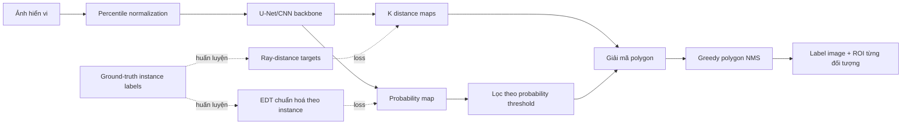

# CHƯƠNG 2. CƠ SỞ LÝ THUYẾT VÀ MÔ HÌNH TOÁN HỌC STARDIST

> Phạm vi: phân đoạn từng đối tượng trong ảnh hiển vi 2D bằng StarDist; Otsu
> và marker-controlled Watershed được dùng làm phương pháp đối chứng.

## 2.1. Phát biểu bài toán

### 2.1.1. Ảnh số và miền ảnh

Gọi ảnh đầu vào là

$$
I:\Omega\rightarrow\mathbb{R}^{C},\qquad
\Omega=\{0,\ldots,H-1\}\times\{0,\ldots,W-1\},
$$

trong đó $H,W$ lần lượt là chiều cao và chiều rộng, còn $C$ là số kênh ảnh.
Với ảnh huỳnh quang đơn kênh, $C=1$; với ảnh mô bệnh học H&E thường dùng
$C=3$.

Ground truth của bài toán instance segmentation là ảnh nhãn

$$
Y:\Omega\rightarrow\{0,1,\ldots,M\}.
$$

$Y(p)=0$ biểu diễn nền; $Y(p)=m>0$ nghĩa là pixel $p$ thuộc đối tượng thứ
$m$. Hai đối tượng cùng loại vẫn phải có hai mã nhãn khác nhau. Đây là điểm
khác căn bản với mask nhị phân.

Mục tiêu của thuật toán là tìm ánh xạ $f_\theta$ sao cho

$$
\widehat{Y}=f_\theta(I)\approx Y,
$$

với $\widehat{Y}$ giữ được cả vùng ảnh của đối tượng và định danh riêng của
từng đối tượng.

### 2.1.2. Semantic, object detection và instance segmentation

- **Semantic segmentation** gán lớp cho từng pixel nhưng không phân biệt hai
  đối tượng cùng lớp. Nếu hai nhân tế bào chạm nhau, toàn bộ vùng có thể trở
  thành một thành phần liên thông.
- **Object detection** định vị từng đối tượng, thường bằng bounding box. Box
  có thể chồng lấn mạnh đối với các nhân gần tròn và nằm sát nhau; box cũng
  không mô tả chính xác biên đối tượng.
- **Instance segmentation** vừa phân loại pixel vừa phân biệt từng cá thể.
  Đây là mục tiêu phù hợp khi cần đếm tế bào, đo diện tích, hình dạng hoặc
  theo dõi từng tế bào.

Bài báo StarDist chỉ ra hai lỗi điển hình trong ảnh đông đối tượng: cách tiếp
cận bottom-up dễ gộp hai đối tượng chỉ vì một số pixel biên bị phân loại sai;
cách tiếp cận bằng bounding box có thể loại nhầm một đối tượng hợp lệ trong
NMS vì hai box chồng lấn quá nhiều [1]. StarDist giải quyết trực tiếp hai vấn
đề này bằng một biểu diễn hình dạng giàu thông tin hơn bounding box.

## 2.2. Nền tảng CNN và U-Net

### 2.2.1. Phép tích chập

Tại lớp tích chập $l$, feature map đầu ra có thể viết dưới dạng

$$
z_{i,j,c}^{(l)} = b_c^{(l)} +
\sum_{u,v}\sum_{c'}w_{u,v,c',c}^{(l)}
a_{i+u,j+v,c'}^{(l-1)},
$$

$$
a_{i,j,c}^{(l)}=\phi\!\left(z_{i,j,c}^{(l)}\right),
$$

trong đó $w$ là kernel học được, $b$ là bias và $\phi$ thường là ReLU:

$$
\mathrm{ReLU}(z)=\max(0,z).
$$

Chia sẻ trọng số giúp CNN phát hiện cùng một đặc trưng ở nhiều vị trí. Các
lớp đầu thường học cạnh hoặc texture; các lớp sâu hơn kết hợp chúng thành
đặc trưng hình dạng và ngữ cảnh.

### 2.2.2. U-Net

U-Net gồm hai nhánh đối xứng [2]:

1. **Contracting path (encoder):** các khối convolution trích xuất đặc trưng,
   downsampling tăng receptive field và thu nhận ngữ cảnh.
2. **Expanding path (decoder):** upsampling phục hồi độ phân giải không gian.
3. **Skip connection:** ghép đặc trưng độ phân giải cao từ encoder sang
   decoder, giúp định vị biên chính xác hơn.

StarDist không dùng U-Net để dự đoán trực tiếp một mask cuối cùng. U-Net đóng
vai trò bộ trích xuất đặc trưng dùng chung cho hai đầu ra: bản đồ xác suất đối
tượng và các khoảng cách theo tia.

Trong cấu hình thí nghiệm gốc, tác giả sử dụng U-Net nhẹ với ba mức down/up,
số filter ở các mức là $32\cdot2^k$ với $k\in\{0,1,2\}$. Sau feature map cuối
có thêm một convolution $3\times3$, 128 kênh và ReLU; sau đó tách thành hai
head [1]. Cấu hình cụ thể trong thư viện có thể thay đổi theo model, vì vậy
báo cáo thực nghiệm phải ghi cấu hình model thực sự được dùng, không mặc định
mọi model pretrained đều giống hệt kiến trúc trong bài báo năm 2018.

### 2.2.3. Luồng thông tin tổng quát



Sơ đồ cho thấy CNN chưa trực tiếp tạo label image. Label cuối chỉ xuất hiện
sau khi hai nhánh dự đoán được kết hợp, proposal được giải mã và NMS được áp
dụng.

## 2.3. Biểu diễn star-convex

### 2.3.1. Định nghĩa

Một tập $S\subset\mathbb{R}^2$ là **star-convex đối với tâm $c\in S$** nếu

$$
\forall x\in S,\quad
[c,x]=\{(1-t)c+tx\mid 0\le t\le1\}\subseteq S.
$$

Nói cách khác, từ tâm $c$ có thể nối đoạn thẳng đến mọi điểm trong vật thể mà
không đi ra ngoài vật thể. Mọi tập lồi đều star-convex, nhưng một tập
star-convex không nhất thiết lồi. Nhân tế bào dạng tròn, ellipse hoặc blob
thường xấp xỉ tốt bởi mô hình này. Vật thể hình vòng, phân nhánh mạnh hoặc có
vết lõm sâu có thể vi phạm giả thiết.

### 2.3.2. Rời rạc hoá biên bằng các tia

Chọn $K$ hướng cố định cách đều nhau:

$$
\theta_k=\frac{2\pi k}{K},\qquad
u_k=(\cos\theta_k,\sin\theta_k),
\qquad k=0,\ldots,K-1.
$$

Với pixel foreground $p$ thuộc instance $m=Y(p)$, khoảng cách ground truth
theo tia thứ $k$ được định nghĩa là

$$
r_k(p)=\inf\{t\ge0\mid Y(p+t u_k)\ne m\}.
$$

Trong ảnh rời rạc, thuật toán tiến dọc theo tia cho đến khi gặp nền hoặc nhãn
instance khác. Vector

$$
\mathbf r(p)=[r_0(p),r_1(p),\ldots,r_{K-1}(p)]
$$

mô tả một đa giác star-convex có tâm tại $p$. Bài báo gốc dùng $K=32$ [1].
Tăng $K$ thường làm biên mịn và chính xác hơn nhưng tăng số kênh đầu ra, chi
phí huấn luyện, bộ nhớ và chi phí tính overlap khi NMS.

### 2.3.3. Giải mã đa giác

Từ tâm $p=(x_p,y_p)$ và khoảng cách dự đoán $\widehat r_k(p)$, đỉnh thứ $k$
của proposal là

$$
v_k(p)=
\begin{bmatrix}
x_p+\widehat r_k(p)\cos\theta_k\\
y_p+\widehat r_k(p)\sin\theta_k
\end{bmatrix}.
$$

Nối tuần tự $v_0,v_1,\ldots,v_{K-1}$ rồi đóng đa giác thu được proposal
$P(p)$. Mạng dự đoán một proposal cho rất nhiều pixel, vì vậy tập proposal
ban đầu là dư thừa có chủ ý. NMS sẽ chọn một đại diện tốt cho mỗi vật thể.

Sai số xấp xỉ hình học phụ thuộc vào:

- số tia $K$;
- vị trí tâm proposal;
- độ chính xác của khoảng cách dự đoán;
- mức độ phù hợp của vật thể với giả thiết star-convex.

Ngay cả khi mạng dự đoán hoàn hảo các khoảng cách theo $K$ hướng, đa giác hữu
hạn đỉnh vẫn có thể không tái tạo pixel-perfect một biên phức tạp. Đây là lý
do StarDist có thể giảm điểm ở các ngưỡng IoU rất cao [1].

## 2.4. Sinh ground truth cho StarDist

Từ ảnh nhãn instance $Y$, StarDist tạo hai đích học dày đặc.

### 2.4.1. Probability map dựa trên distance transform

Với instance $S_m=\{p\in\Omega\mid Y(p)=m\}$, đặt

$$
D_m(p)=\min_{q\notin S_m}\|p-q\|_2,\qquad p\in S_m.
$$

Probability target được chuẩn hoá riêng trong mỗi instance:

$$
d(p)=
\begin{cases}
\dfrac{D_m(p)}{\max_{q\in S_m}D_m(q)+\varepsilon},
& p\in S_m,\\[6pt]
0,&Y(p)=0.
\end{cases}
$$

Do đó $d(p)$ gần 0 ở biên, tăng dần về vùng trung tâm và đạt xấp xỉ 1 tại
điểm sâu nhất trong vật thể. Mã nguồn chính thức thực hiện Euclidean distance
transform rồi chuẩn hoá theo maximum của từng label [8].

Tên gọi “object probability” dễ khiến người đọc hiểu đây là nhãn 0/1. Thực
tế, target là một giá trị mềm có cấu trúc không gian. Ý nghĩa của nó gồm:

- ước lượng mức tin cậy pixel thuộc vùng trung tâm của vật thể;
- ưu tiên proposal xuất phát gần tâm, nơi các tia thường tái tạo hình dạng
  ổn định hơn;
- cung cấp score để sắp xếp candidate trong NMS.

### 2.4.2. Distance map

Tại mỗi pixel foreground, ground truth thứ hai là vector $K$ khoảng cách
$\mathbf r(p)$. Toàn bộ tensor distance có kích thước $H\times W\times K$.
Khoảng cách không có ý nghĩa hình học đối với pixel nền; phần loss khoảng cách
vì vậy phải được mask hoặc gán trọng số rất nhỏ cho nền.

## 2.5. Mô hình dự đoán và hàm mất mát

Với ảnh $I$, mạng sinh hai đầu ra:

$$
(\widehat d,\widehat R)=f_\theta(I),
$$

trong đó $\widehat d\in[0,1]^{H'\times W'}$ là probability map và
$\widehat R\in\mathbb{R}^{H'\times W'\times K}$ là distance map. Head xác
suất dùng sigmoid; head khoảng cách trong mô hình gốc là lớp tuyến tính có
$K$ kênh [1].

### 2.5.1. Loss xác suất

Binary cross-entropy với target mềm $d(p)$:

$$
\mathcal L_{\mathrm{prob}}
=-\frac{1}{|\Omega'|}\sum_{p\in\Omega'}
\left[d(p)\log\widehat d(p)+
(1-d(p))\log(1-\widehat d(p))\right].
$$

### 2.5.2. Loss khoảng cách

Bài báo gốc sử dụng mean absolute error được đặt trọng số bằng probability
ground truth [1]:

$$
\mathcal L_{\mathrm{dist}}
=\frac{1}{|\Omega'|K}
\sum_{p\in\Omega'}d(p)
\sum_{k=0}^{K-1}|r_k(p)-\widehat r_k(p)|.
$$

Vì $d(p)=0$ ở nền, nền không chi phối bài toán hồi quy khoảng cách. Sai số
gần tâm được đặt trọng số lớn hơn sai số gần biên, phù hợp với việc NMS ưu
tiên proposal ở trung tâm.

Loss tổng quát:

$$
\mathcal L=\lambda_p\mathcal L_{\mathrm{prob}}
+\lambda_r\mathcal L_{\mathrm{dist}},
$$

với $\lambda_p,\lambda_r$ là trọng số hai nhiệm vụ. Thư viện StarDist hiện
cho phép một số biến thể loss khoảng cách, nhưng khi trình bày lại bài báo gốc
cần giữ MAE có trọng số như trên [1,9].

## 2.6. Suy luận và Non-Maximum Suppression

### 2.6.1. Tiền xử lý

Ảnh thường được percentile-normalize để giảm ảnh hưởng của một số pixel quá
tối hoặc quá sáng. Với hai percentile $q_{\min}$ và $q_{\max}$:

$$
I'(p)=\mathrm{clip}\left(
\frac{I(p)-q_{\min}}{q_{\max}-q_{\min}+\varepsilon},0,1
\right).
$$

Các percentile, kênh ảnh, phép resize và bit depth phải giống nhau giữa Fiji
và Python nếu muốn kiểm chứng kết quả công bằng.

### 2.6.2. Tạo candidate

Chỉ các vị trí thoả

$$
\widehat d(p)>\tau_{\mathrm{prob}}
$$

được giải mã thành polygon candidate. Khi tăng
$\tau_{\mathrm{prob}}$, số proposal giảm: false positive thường giảm nhưng
false negative có thể tăng. Ngược lại, threshold thấp tăng recall và tăng cả
chi phí NMS.

### 2.6.3. Greedy NMS

Giả sử có các proposal $(P_i,s_i)$ với $s_i=\widehat d(p_i)$. Quy trình:

1. Sắp xếp proposal theo $s_i$ giảm dần.
2. Giữ proposal có score cao nhất chưa bị loại.
3. Loại các proposal còn lại nếu mức overlap với proposal vừa giữ lớn hơn
   $\tau_{\mathrm{nms}}$.
4. Lặp lại đến khi hết proposal.

Một độ đo overlap thường dùng là

$$
\mathrm{IoU}(P_i,P_j)=
\frac{|P_i\cap P_j|}{|P_i\cup P_j|}.
$$

Tuy nhiên, khi tái lập chính xác phần hậu xử lý cần bám theo phiên bản mã
nguồn/plugin được sử dụng. Triển khai C++ NMS 2D hiện tại của StarDist tính
phần giao chuẩn hoá bởi diện tích polygon nhỏ hơn,
$|P_i\cap P_j|/\min(|P_i|,|P_j|)$ [10], chứ không phải IoU chuẩn hoá bởi hợp.
Một docstring Python lại gọi đại lượng này là IoU, nên nhóm phải ghi rõ công
thức của bản tự cài đặt và không nên khẳng định hai implementation giống hệt
chỉ dựa trên tên tham số.

Ý nghĩa threshold:

- $\tau_{\mathrm{nms}}$ thấp: suppression mạnh, ít instance được giữ, có nguy
  cơ bỏ đối tượng thật nằm sát nhau.
- $\tau_{\mathrm{nms}}$ cao: cho phép overlap lớn hơn, có nguy cơ giữ nhiều
  proposal của cùng một đối tượng.

Probability threshold quyết định proposal nào **được đưa vào** NMS; overlap
threshold quyết định proposal nào **sống sót** sau NMS. Hai tham số tương tác
và phải được chọn trên validation set.

### 2.6.4. Pseudocode StarDist 2D

```text
TRAIN(Y, I):
    d_true    <- normalized_EDT_per_instance(Y)
    r_true    <- radial_distances(Y, K directions)
    d_hat, r_hat <- CNN(I)
    loss <- BCE(d_true, d_hat) + lambda * weighted_MAE(r_true, r_hat, d_true)
    update network weights

INFERENCE(I, tau_prob, tau_nms):
    I_norm <- percentile_normalize(I)
    d_hat, r_hat <- CNN(I_norm)
    candidates <- empty list
    for every prediction-grid pixel p:
        if d_hat[p] > tau_prob:
            polygon <- decode_polygon(p, r_hat[p])
            candidates.append((polygon, d_hat[p]))
    candidates <- sort candidates by score descending
    selected <- greedy_polygon_NMS(candidates, tau_nms)
    return rasterize_selected_polygons_as_instance_labels(selected)
```

Độ phức tạp thô của bước dự đoán CNN phụ thuộc kích thước mạng và số pixel.
NMS toàn cặp có thể tới $O(N^2)$ với $N$ candidate; triển khai thực tế dùng
bounds/KD-tree hoặc các chiến lược lọc không gian để giảm số cặp cần tính.
Tài liệu chính thức cũng tách suy luận thành hai pha: CNN có thể dùng GPU, còn
NMS chạy CPU và tận dụng đa lõi [7].

## 2.7. Phương pháp đối chứng Otsu

### 2.7.1. Mô hình hai lớp theo histogram

Với ảnh mức xám có $L$ mức, gọi $n_i$ là số pixel mức $i$, $N$ là tổng số
pixel và

$$
p_i=\frac{n_i}{N},\qquad i=0,\ldots,L-1.
$$

Một threshold $t$ chia histogram thành hai lớp
$C_0=\{0,\ldots,t\}$ và $C_1=\{t+1,\ldots,L-1\}$. Xác suất lớp:

$$
\omega_0(t)=\sum_{i=0}^{t}p_i,\qquad
\omega_1(t)=1-\omega_0(t).
$$

Trung bình lớp:

$$
\mu_0(t)=\frac{\sum_{i=0}^{t}i p_i}{\omega_0(t)},\qquad
\mu_1(t)=\frac{\sum_{i=t+1}^{L-1}i p_i}{\omega_1(t)}.
$$

Phương sai giữa hai lớp:

$$
\sigma_B^2(t)=\omega_0(t)\omega_1(t)
[\mu_0(t)-\mu_1(t)]^2.
$$

Ngưỡng Otsu là

$$
t^*=\arg\max_t\sigma_B^2(t).
$$

Tiêu chuẩn này tương đương tối thiểu hoá phương sai trong lớp. Otsu là phương
pháp không giám sát, không cần dữ liệu huấn luyện và rất nhanh [3].

### 2.7.2. Từ semantic mask đến instance

Sau threshold:

$$
B(p)=\mathbb{1}[I(p)>t^*]
$$

(hoặc đảo dấu nếu đối tượng tối hơn nền), connected-component labeling biến
các vùng rời nhau thành instance. Nhưng hai tế bào chạm nhau tạo thành một
component và bị gộp. Otsu cũng giả định histogram toàn ảnh có thể tách hợp lý
thành hai lớp; nền không đều, stain khác nhau và vật thể mờ làm giả định này
yếu đi.

## 2.8. Phương pháp đối chứng marker-controlled Watershed

### 2.8.1. Trực giác địa hình

Watershed xem một ảnh vô hướng như bề mặt địa hình. Các minimum là basin;
nước dâng từ các basin cho đến khi các lưu vực gặp nhau, tạo đường phân thuỷ
[4]. Nếu dùng trực tiếp gradient nhiễu, quá nhiều minimum gây
over-segmentation.

### 2.8.2. Watershed trên distance transform

Với binary foreground $B$, distance transform trong foreground:

$$
D(p)=\min_{q:B(q)=0}\|p-q\|_2.
$$

Các local maximum của $D$ thường nằm gần tâm đối tượng và được dùng làm
marker. Thực hiện watershed trên $-D$ bên trong mask $B$:

$$
\widehat Y_{\mathrm{WS}}
=\mathrm{Watershed}(-D,\,M,\,\text{mask}=B),
$$

trong đó $M$ là ảnh marker. Watershed có thể tách các blob đang chạm nhau,
nhưng kết quả phụ thuộc mạnh vào:

- chất lượng binary mask ban đầu;
- tham số lọc nhiễu và morphology;
- khoảng cách tối thiểu/h-minima khi phát hiện marker;
- việc mỗi đối tượng có đúng một marker hay không.

Quá nhiều marker làm tách thừa; thiếu marker làm gộp đối tượng. Vì vậy
Watershed là baseline mạnh hơn Otsu + connected components, nhưng không tự học
texture và hình dạng từ dữ liệu.

## 2.9. So sánh bản chất ba phương pháp

| Tiêu chí | Otsu + CC | Otsu + Watershed | StarDist |
|---|---|---|---|
| Loại phương pháp | Histogram, không học | Hình thái/toán địa hình | Deep learning có shape prior |
| Đầu ra trực tiếp | Binary/semantic | Instance từ marker | Instance polygon |
| Tách vật chạm nhau | Kém | Tốt nếu marker đúng | Tốt với dữ liệu phù hợp |
| Dùng texture/ngữ cảnh | Không | Rất hạn chế | Có, qua CNN |
| Dữ liệu huấn luyện | Không | Không | Cần khi train/fine-tune |
| Nhạy nền không đều | Cao | Cao do phụ thuộc mask | Tuỳ mức domain shift |
| Nhạy nhiễu | Histogram thay đổi | Marker dễ tách thừa | Phụ thuộc train data |
| Shape prior | Không | Gián tiếp qua distance map | Star-convex trực tiếp |
| Chi phí tính toán | Thấp | Thấp–trung bình | Cao hơn, có thể cần GPU |
| Khả năng giải thích | Cao | Cao | Thấp hơn, nhưng đầu ra hình học rõ |

So sánh công bằng không có nghĩa ba phương pháp phải giống nhau về nội tại;
nó có nghĩa chúng nhận cùng tập test, cùng quy tắc loại bỏ vật thể biên/nhỏ,
cùng định dạng đầu ra và cùng metric instance.

## 2.10. Đánh giá định lượng

### 2.10.1. Ghép cặp instance

Với ground-truth instance $G_i$ và predicted instance $P_j$:

$$
\mathrm{IoU}_{ij}
=\frac{|G_i\cap P_j|}{|G_i\cup P_j|}.
$$

Tại ngưỡng $\tau$, một cặp là đúng nếu
$\mathrm{IoU}_{ij}\ge\tau$. Matching phải là một-một; có thể giải bài
toán gán tối ưu để tối đa số cặp đạt ngưỡng, rồi dùng tổng IoU làm tiêu chí
phụ khi hoà [9]. Sau matching:

- TP: số cặp đúng;
- FP: prediction không ghép được;
- FN: ground truth không ghép được.

### 2.10.2. Precision, Recall, F1 và AP theo StarDist

$$
\mathrm{Precision}_{\tau}
=\frac{TP_{\tau}}{TP_{\tau}+FP_{\tau}},
$$

$$
\mathrm{Recall}_{\tau}
=\frac{TP_{\tau}}{TP_{\tau}+FN_{\tau}},
$$

$$
F1_{\tau}
=\frac{2TP_{\tau}}{2TP_{\tau}+FP_{\tau}+FN_{\tau}}.
$$

Bài báo StarDist/DSB gọi đại lượng sau là Average Precision tại ngưỡng $\tau$
[1]:

$$
AP_{\tau}=\frac{TP_{\tau}}
{TP_{\tau}+FP_{\tau}+FN_{\tau}}.
$$

Đại lượng này giống Jaccard/accuracy trên tập instance và **không phải** AP
dạng diện tích dưới đường precision–recall thường gặp trong object detection.
Báo cáo phải nêu định nghĩa để tránh hiểu nhầm. Có thể tổng hợp nhiều ngưỡng:

$$
mAP=\frac{1}{|T|}\sum_{\tau\in T}AP_{\tau},
\quad T=\{0.50,0.55,\ldots,0.90\}.
$$

### 2.10.3. Dice và IoU foreground

Gộp mọi instance thành foreground $G$ và $P$:

$$
\mathrm{Dice}=
\frac{2|G\cap P|}{|G|+|P|},\qquad
\mathrm{IoU}_{fg}=
\frac{|G\cap P|}{|G\cup P|}.
$$

Hai metric này đo phủ vùng nhưng không phạt đầy đủ lỗi gộp/tách instance. Ví
dụ, hai tế bào bị gộp vẫn có thể có Dice cao. Vì vậy chúng chỉ là metric bổ
sung, không nên là kết quả chính.

### 2.10.4. Panoptic Quality

Với tập cặp đã match:

$$
PQ=\frac{\sum_{(i,j)\in TP}\mathrm{IoU}(G_i,P_j)}
{|TP|+\frac12|FP|+\frac12|FN|}.
$$

PQ có thể tách thành

$$
PQ=SQ\times RQ,
$$

trong đó

$$
SQ=\frac{1}{|TP|}\sum_{(i,j)\in TP}\mathrm{IoU}(G_i,P_j),
$$

$$
RQ=\frac{|TP|}{|TP|+\frac12|FP|+\frac12|FN|}.
$$

$SQ$ phản ánh chất lượng biên của các đối tượng đã tìm thấy; $RQ$ phản ánh
chất lượng nhận dạng/tách instance [5]. Báo cáo nên trình bày cả hai để biết
StarDist hơn baseline vì phát hiện đúng nhiều hơn hay vì biên chính xác hơn.

### 2.10.5. Sai số đếm và thời gian

Với ảnh $n$, đặt $c_n^{gt}$ và $c_n^{pred}$ là số đối tượng:

$$
MAE_{count}=\frac1N\sum_{n=1}^{N}
|c_n^{pred}-c_n^{gt}|,
$$

$$
MRE_{count}=\frac1N\sum_{n=1}^{N}
\frac{|c_n^{pred}-c_n^{gt}|}{c_n^{gt}+\varepsilon}.
$$

Thời gian nên báo cáo theo millisecond/ảnh hoặc giây/megapixel, tách warm-up
nếu dùng mạng neural và ghi rõ CPU/GPU.

## 2.11. Ưu điểm, hạn chế và điều kiện áp dụng StarDist

### 2.11.1. Ưu điểm

- Dự đoán instance trực tiếp thay vì chỉ semantic mask.
- Polygon bám hình dạng nhân tốt hơn bounding box.
- Đối tượng chạm nhau vẫn có proposal riêng, giảm lỗi merge.
- Shape representation gọn: mỗi proposal chỉ cần tâm, score và $K$ bán kính.
- Có thể xuất label image và ROI để đo đạc tiếp trong Fiji [6].
- Probability map và polygon giúp hậu xử lý có diễn giải hình học rõ hơn nhiều
  mô hình instance segmentation tổng quát.

### 2.11.2. Hạn chế

- Giả thiết star-convex không phù hợp với vật thể dạng vòng, chữ U, sợi dài
  phân nhánh hoặc lõm sâu.
- Đa giác hữu hạn tia giới hạn độ chính xác biên ở IoU rất cao.
- Model pretrained có thể thất bại khi stain, modality, kích thước đối tượng,
  độ phóng đại hoặc nhiễu khác miền huấn luyện.
- NMS có thể bỏ sót hai đối tượng thật chồng lấn mạnh hoặc giữ duplicate nếu
  threshold quá cao.
- Vật thể lớn hơn receptive field hoặc khác scale huấn luyện cần rescale hay
  train lại.
- Kết quả gần biên tile/ảnh có thể kém nếu context không đủ.
- Fiji plugin chủ yếu phục vụ inference model đã huấn luyện; training và các
  tính năng đầy đủ nằm ở Python [6,7].

### 2.11.3. Kiểm tra tính phù hợp của shape prior

Trước khi train, nên tái tạo ground-truth instance bằng chính biểu diễn
star-convex với $K$ tia và đo reconstruction IoU. Nếu reconstruction đã thấp,
mạng không thể vượt qua giới hạn hình học này dù học tốt. FAQ chính thức gợi ý
mean reconstruction IoU khoảng 0.8 trở lên thường là dấu hiệu biểu diễn đủ phù
hợp [7]. Đây là một thí nghiệm nhỏ nhưng có giá trị để biện minh lựa chọn
StarDist.

## 2.12. Giả thuyết nghiên cứu

Các giả thuyết sau có thể kiểm chứng định lượng:

**H1.** StarDist đạt $AP_{0.5}$, F1 instance và PQ cao hơn Otsu và Watershed
trên ảnh có nhiều đối tượng chạm nhau.

**H2.** Otsu có thời gian xử lý thấp nhất nhưng sai số đếm lớn nhất trong nhóm
ảnh crowded do merge các component.

**H3.** Watershed giảm lỗi merge so với Otsu, nhưng dễ tăng FP/tách thừa khi
marker được phát hiện quá dày.

**H4.** Tăng probability threshold làm Precision tăng và Recall giảm; tồn tại
một vùng threshold tối ưu trên validation set.

**H5.** Tăng overlap/NMS threshold ban đầu làm số instance giữ lại tăng; quá
cao sẽ tăng duplicate và FP.

**H6.** Lợi thế của StarDist rõ hơn ở metric instance như AP/PQ/count MAE so
với Dice foreground, bởi Dice không phản ánh đầy đủ lỗi merge/split.

**H7.** Khi domain ảnh khác model pretrained, khoảng cách hiệu năng giữa
StarDist và baseline có thể giảm; normalization hoặc fine-tuning sẽ cải thiện
kết quả.

## 2.13. Thiết kế ablation tối thiểu suy ra từ lý thuyết

1. **Probability threshold sweep:** cố định NMS threshold, thử ít nhất 5 giá
   trị và vẽ Precision–Recall/F1/PQ.
2. **NMS threshold sweep:** cố định probability threshold, đo số đối tượng,
   FP, FN và thời gian.
3. **Mật độ đối tượng:** chia ảnh thành sparse và crowded dựa trên tỷ lệ đối
   tượng chạm/gần nhau; so sánh ba phương pháp trong từng nhóm.
4. **Độ phù hợp hình dạng:** đo reconstruction IoU với $K=16,32,64$ nếu phần
   cài đặt cho phép.
5. **Độ bền với nhiễu/nền:** thêm Gaussian noise hoặc illumination gradient ở
   các mức kiểm soát, không thay đổi ground truth, rồi đo mức suy giảm metric.
6. **Thời gian:** đo riêng inference mạng và NMS nếu có thể; Otsu, morphology,
   distance transform và Watershed cũng nên được ghi thời gian từng bước.

## 2.14. Các lỗi phương pháp luận cần tránh

- Tối ưu threshold trên test set rồi báo cáo chính test set đó.
- So sánh label image StarDist với binary mask Otsu mà chưa connected-component
  labeling hoặc Watershed.
- Dùng pixel accuracy trên ảnh có nền lớn; metric này có thể rất cao dù bỏ
  nhiều tế bào.
- Chỉ báo cáo một ảnh đẹp hoặc chỉ đánh giá bằng mắt.
- Gọi trực tiếp model pretrained rồi tuyên bố đã “cài đặt lại toàn bộ
  StarDist”. Cần tách phần sử dụng thư viện và phần nhóm tự cài đặt.
- Không ghi chiều ảnh, bit depth, kênh, normalization, resize, model và hai
  threshold.
- Dùng cùng chữ “AP” mà không đưa công thức.
- Cho Fiji và Python chạy trên hai ảnh đã tiền xử lý khác nhau.
- Dùng file mask RGB nhiều màu nhưng đọc thành grayscale khiến ID instance bị
  mất hoặc thay đổi.

## 2.15. Kết luận chương

StarDist chuyển bài toán instance segmentation từ dự đoán mask pixel thuần
tuý thành dự đoán dày đặc các giả thuyết hình học. Mỗi pixel cung cấp một
score trung tâm và một đa giác star-convex; NMS biến tập giả thuyết dư thừa
thành các instance cuối cùng. Cơ chế này đặc biệt phù hợp với nhân/tế bào dạng
blob và giải quyết trực tiếp lỗi gộp khi đối tượng chạm nhau.

Otsu cung cấp baseline histogram đơn giản, còn marker-controlled Watershed bổ
sung cơ chế tách blob thông qua distance transform và marker. Ba phương pháp
đại diện cho ba mức giả định và độ phức tạp khác nhau. Đánh giá cần ưu tiên
metric instance dựa trên matching IoU, kết hợp AP/F1/PQ, sai số đếm và thời
gian, đồng thời dùng Dice/IoU foreground làm thông tin bổ sung.

## Tài liệu tham khảo của chương

[1] U. Schmidt, M. Weigert, C. Broaddus, G. Myers, “Cell Detection with
Star-convex Polygons,” MICCAI, 2018. DOI:
[10.1007/978-3-030-00934-2_30](https://doi.org/10.1007/978-3-030-00934-2_30).

[2] O. Ronneberger, P. Fischer, T. Brox, “U-Net: Convolutional Networks for
Biomedical Image Segmentation,” MICCAI, 2015. DOI:
[10.1007/978-3-319-24574-4_28](https://doi.org/10.1007/978-3-319-24574-4_28).

[3] N. Otsu, “A Threshold Selection Method from Gray-Level Histograms,” IEEE
Transactions on Systems, Man, and Cybernetics, 1979. DOI:
[10.1109/TSMC.1979.4310076](https://doi.org/10.1109/TSMC.1979.4310076).

[4] L. Vincent, P. Soille, “Watersheds in Digital Spaces: An Efficient
Algorithm Based on Immersion Simulations,” IEEE TPAMI, 1991. DOI:
[10.1109/34.87344](https://doi.org/10.1109/34.87344).

[5] A. Kirillov, K. He, R. Girshick, C. Rother, P. Dollár, “Panoptic
Segmentation,” CVPR, 2019. [CVF Open Access](https://openaccess.thecvf.com/content_CVPR_2019/html/Kirillov_Panoptic_Segmentation_CVPR_2019_paper.html).

[6] ImageJ, “StarDist plugin.”
[Tài liệu chính thức](https://imagej.net/plugins/stardist), truy cập ngày
08/09/2026.

[7] StarDist, “Frequently Asked Questions.”
[Tài liệu chính thức](https://github.com/stardist/stardist-docs/blob/main/docs/faq.md),
truy cập ngày 08/09/2026.

[8] StarDist, `utils.py`, hàm `edt_prob`.
[Mã nguồn chính thức](https://github.com/stardist/stardist/blob/main/stardist/utils.py),
truy cập ngày 08/09/2026.

[9] StarDist, `matching.py` và `models/base.py`.
[Mã nguồn chính thức](https://github.com/stardist/stardist), truy cập ngày
08/09/2026.

[10] StarDist, `nms.py` và `lib/stardist2d.cpp`.
[Mã nguồn chính thức](https://github.com/stardist/stardist/blob/main/stardist/lib/stardist2d.cpp),
truy cập ngày 08/09/2026.

[11] N. Kumar et al., “A Dataset and a Technique for Generalized Nuclear
Segmentation for Computational Pathology,” IEEE Transactions on Medical
Imaging, 2017. DOI:
[10.1109/TMI.2017.2677499](https://doi.org/10.1109/TMI.2017.2677499).

[12] M. Weigert et al., “Star-convex Polyhedra for 3D Object Detection and
Segmentation in Microscopy,” WACV, 2020.
[CVF Open Access](https://openaccess.thecvf.com/content_WACV_2020/html/Weigert_Star-convex_Polyhedra_for_3D_Object_Detection_and_Segmentation_in_Microscopy_WACV_2020_paper.html).
